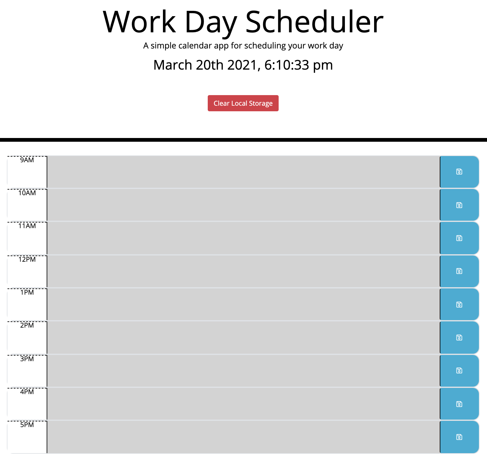

# Work Day Scheduler

## Description

When users open the page the current date and time will display. Users can log events into a daily planner. Events can be logged for each hour of a typical work day. Users can then save the text written in each time block, causing it to persist even if the page refreshes. Time blocks that have already passed are gray, current time-blocks are red, and future time blocks are green.

## Installation

There is no installation required to use this webpage.

## Usage

Users can click into any of the 9 time blocks to enter an event, where they can type any text they want. Next to each time block is a button which users can press to save the text in the corresponding time block. Any text that is saved will persist even if the page is closed or refreshed. Text in all time blocks will automatically be removed the next day. In addition, a button at the top allows users to clear their local storage. After pushing this button, refreshing the page will remove all text from the page.

## Features

While this page has no break points, its simple design will display nicely across tablet sizes and above.

## Technologies Used

HTML, CSS, JS, JQuery, Bootstrap

## Credits

Jeff DeRosalia, Dan Rosenbaum

## Link

https://ryanascherr.github.io/work-day-scheduler/

## Contact Information

ryanascherr@gmail.com
